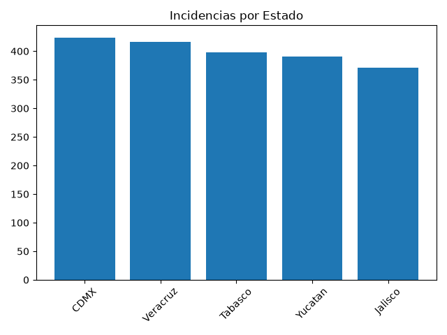
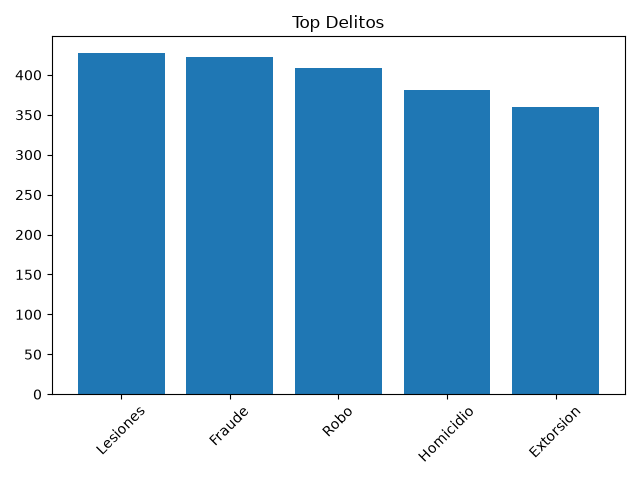

# Análisis de Incidencias Delictivas en México

Proyecto ETL completo de 0 a reporte ejecutivo.

**Stack:** Python (Pandas, Matplotlib), PostgreSQL 18, SQL Intermedio

**Proceso:**
1. Limpieza y generación de 2000 registros con Python
2. Carga a PostgreSQL (public.incidencia)
3. Análisis SQL: GROUP BY, JOIN, CASE WHEN, RANK() OVER (PARTITION BY)
4. Visualización: 3 gráficas por estado/delito/tendencia
5. Reporte automatizado en Excel

**Insight principal (Tabasco):** Delito #1 es Fraude (93 casos) con RANK() window function.

Autor: dev1ceIWNL - Paraíso, Tabasco

